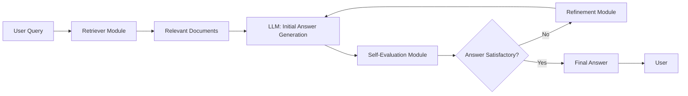

# Self-RAG: Advanced Self-Reflective Retrieval-Augmented Generation System

## 🚀 Overview

Self-RAG is a cutting-edge Retrieval-Augmented Generation (RAG) architecture enhanced with a **self-reflective mechanism**.  
This system enables a language model not only to retrieve and generate an answer based on a knowledge base but also to **critically evaluate, critique, and iteratively improve its own responses** before delivering the final output.

The goal is to significantly improve **factual accuracy, coherence, and relevance** while minimizing hallucinations and errors typical of large language models.

---

## 🎯 Key Objectives

- **Intelligent Retrieval**: Utilize vector search engines (FAISS, Chroma) to extract the most relevant documents from large knowledge bases.
- **Initial Generation**: Employ powerful language models (GPT-4, LLaMA, etc.) to produce a context-aware preliminary answer.
- **Self-Critical Evaluation**: Implement a module that analyzes the generated answer to detect factual mistakes, contradictions, or insufficient detail.
- **Iterative Refinement**: Generate an improved answer based on self-assessment feedback, iterating until a quality threshold is reached.
- **Modular & Extensible Pipeline**: Easily swap retrieval, LLM, and evaluation components.
- **Multi-Domain Applicability**: Virtual assistants, chatbots, Q&A systems, automated customer support, and more.

---

## 🧩 Architecture & Pipeline


## Step-by-Step Breakdown

### Retrieval  
The system queries a vector index (FAISS or Chroma) using the query embedding and retrieves the top-k relevant documents.

### Initial Generation  
The retrieved documents serve as context for the LLM, which generates an initial response.

### Self-Evaluation  
- The generated answer is analyzed via a secondary LLM call or custom module to detect factual errors, inconsistencies, or lack of completeness.  
- A diagnostic report is produced about the answer quality.

### Refinement  
- If issues are detected, the refinement module feeds back these critiques to the LLM, prompting it to produce a corrected and enhanced answer.  
- Multiple iterations can occur until the answer meets quality criteria.

### Output  
The refined, high-quality answer is returned to the user.

---

## 🔧 Technologies Used

- Python 3.10+  
- LangChain – for orchestrating the RAG pipeline  

**Vector Stores:**  
- FAISS (Facebook AI Similarity Search)  
- ChromaDB (open-source vector database)  

**Language Models:**  
- OpenAI GPT-4 / GPT-3.5 (API)  
- Optional open-source alternatives (LLaMA, Falcon, etc.)  

- Self-Evaluation Module: Secondary LLM calls with tailored prompts for critique  
- Prompt Management: Dynamic prompt templates and multi-turn dialogues  
- Containerization: Docker support for easy deployment  
- CI/CD: GitHub Actions workflows  
- Testing: Pytest for unit and integration testing  

---

## ⚙️ Installation & Setup

### Prerequisites

- Python 3.10 or higher  
- OpenAI API key or equivalent LLM access  
- Virtual environment recommended (venv, conda)

### Steps

```bash
git clone https://github.com/your-username/Self_RAG.git
cd Self_RAG
python -m venv venv
source venv/bin/activate     # Linux/macOS
venv\Scripts\activate.bat    # Windows
pip install -r requirements.txt
```
## Configuration

Rename `.env.example` to `.env` and add your API keys:

```env
OPENAI_API_KEY=sk-xxxxxxxxxxxxxxxxxxxxxxxxxxxx

```
Customize parameters in configs/config.yaml (e.g., number of retrieved documents, evaluation thresholds).

## ▶️ Usage Example
Run the pipeline with a question:

```bash
python main.py --query "What are the impacts of climate change on biodiversity?"
Example output:
🔎 Retrieving top 5 documents...
✍️ Generating initial answer...
🧐 Performing self-evaluation...
♻️ Refining the response...
✅ Final answer ready:

Climate change impacts biodiversity by altering natural habitats, disrupting migratory patterns, and increasing species extinction risks...
```

## 🧪 Testing & Quality Assurance

- Comprehensive unit tests for all modules.  
- End-to-end integration tests of the pipeline.  
- Code coverage analysis and continuous integration.  
- Validation of prompt effectiveness on various queries.

---

## 📈 Performance Optimizations

- Embedding caching for faster retrieval.  
- Batch processing of API calls.  
- Dynamic adjustment of retrieval count based on query complexity.  
- Detailed logging for audit and debugging.  
- Potential feedback loop for continual learning.

---

## 🌐 Use Cases & Future Directions

- Intelligent Virtual Assistants with self-correction capabilities.  
- Advanced Domain-Specific Search & QA (legal, medical, technical fields).  
- Personalized Education with iterative explanation improvement.  
- Automated Customer Support minimizing errors and misunderstandings.  
- Integration with proprietary knowledge bases for enterprise solutions.

---

## 🤝 Contributing

Contributions are welcome!  
Please open issues for bugs or feature requests, and submit pull requests with clear descriptions and tests.

---

## 📜 License

This project is licensed under the MIT License – see the LICENSE file for details.

---

## 📚 References

- RAG: Retrieval-Augmented Generation (Lewis et al.)  
- Self-RAG Paper: Learning to Retrieve, Generate, and Critique (2023)  
- LangChain Documentation  
- FAISS GitHub  
- OpenAI API Documentation  

---

## 📞 Contact

For questions or collaboration inquiries, please contact:  
booughattaskhawla@gmail.com
GitHub: [(https://github.com/KhaoulaBoughattas)]


